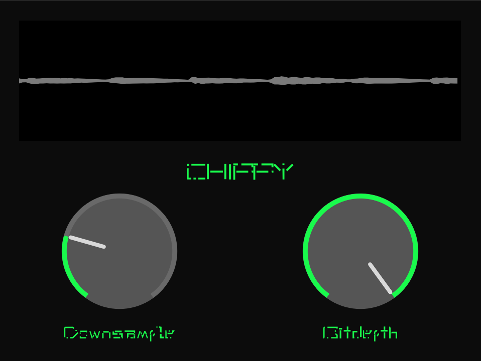

# Chippy
A Bitcrusher and Downsampling plugin written with the JUCE audio framework

# How to build
first clone the repository with its submodules \
`git clone --recursive https://github.com/MalekDeKalem/Chippy.git` \
If you already have the Projucer you just need to open the Chippy.jucer file and save it. \
After that there should be a Builds folder in the root directory of the project simply navigate to Builds and 
pick the Build folder that is appropriate for your system. For me that would be the LinuxMakefile that gets generated. \
So I would navigate there and run the `make` command (make sure you have the make command) that would generate a build folder and also 
would generate a `.vst3` folder in your systems home directory with the `Chippy.vst3` \

If you however do not have the Projucer installed simply go to the JUCE/extras/Projucer/Builds... and build the Projucer again with the `make` command if you use the 
LinuxMakefile \

Thats it have fun with the Plugin

# How it looks 

